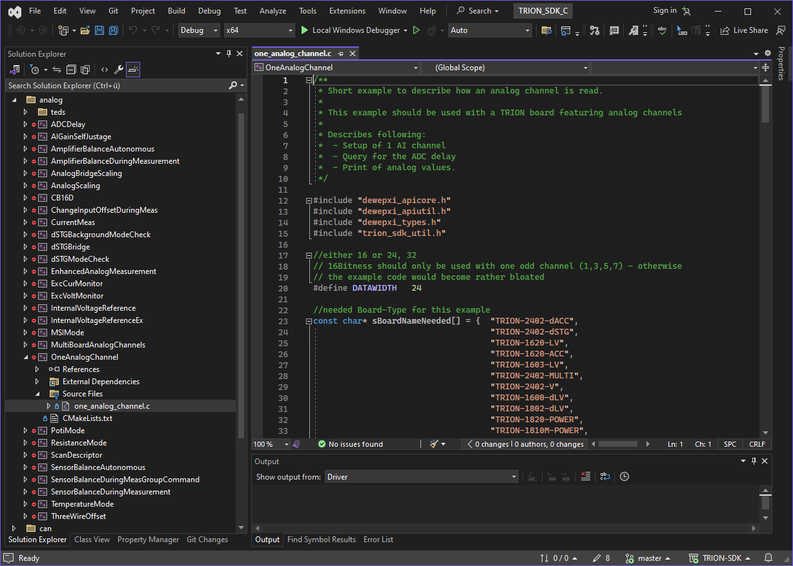
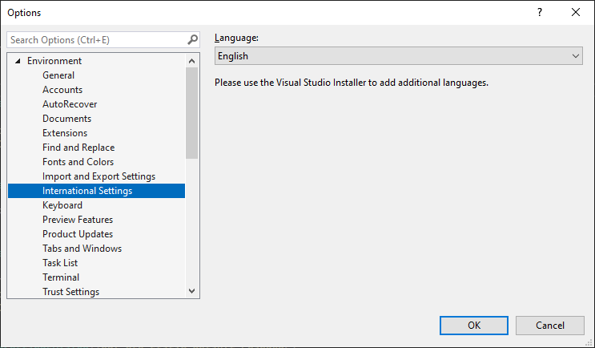
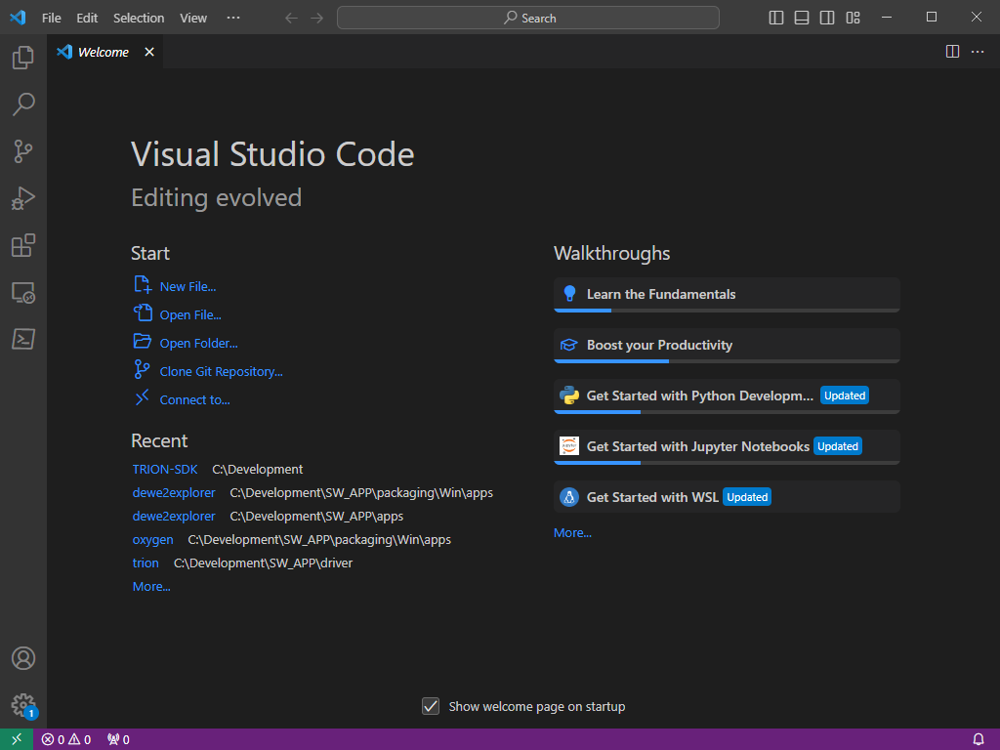

Introduction
============

.. list-table:: 

   * - .. figure:: ../_img/TRION-series-modules-in-a-row-768x314.jpg
           :alt: TRION devices
           :width: 5in

           TRION and TRION3 modules

     - .. figure:: ../_img/TRIONet-smallest-power-analyzer.jpg
           :alt: TRIONet and TRIONet3 frontends

           TRIONet and TRIONet3 frontends

     - .. figure:: ../_img/NEXDAQ-in-a-hand-for-windows-and-linux.jpg
           :alt: NEX[DAQ] devices

           NEX[DAQ] devices

This SDK allows developers to integrate the support for DEWETRON TRION measurement hardware into their own
measurement application. 

To show its usage, the SDK provides an number of examples each showing and explaining a specific aspect of
TRION API and hardware.

TRION API library is portable and supports various operating systems like Windows (up to 11) and Linux.

Intended audience
-----------------

The targeted audience are software developers with good knowledge of C and C++. Experience in measurement 
engineering is helpful.

TRION SDK
---------

TRION SDK is hosted on GitHub and freely accessable:

https://github.com/DEWETRON/TRION-SDK

Please clone the repository to get the necessary source code.

Alternatively it is possible to download the latest
TRION SDK Release:

https://github.com/DEWETRON/TRION-SDK/releases

Supported Programming Languages
-------------------------------

The API can be used by any language that is able to load a dll and call C style functions.

Examples are provided for:

 * C
 * C++
 * C#
 * Python

Supported Operating Systems
---------------------------

Following operating systems are supported by Oxygen:

 * Microsoft Windows 7,10,11 (64bit)
 * Ubuntu 20.04 LTS Linux (Focal Fossa)
 * Red Hat Enterprise Linux 8 (RHEL8)

Compatible (and free) alternatives to RHEL8 are:

 * Rocky Linux 8
 * AlmaLinux 8
 * Oracle Linux 8

Visual Studio on Microsoft Windows
----------------------------------

CMake (https://cmake.org/)

Microsoft Visual Studio 2022 or better (https://visualstudio.microsoft.com/de/downloads/)

*This is the preferred reference development setup*

    Visual Studio 2022

.. note:: Visual Studio allows to set its GUI interface language to English. Using this helps us 
    understanding your problems if you need support.

    Visual Studio International Settings

Visual Studio Code on Ubuntu Linux
----------------------------------

CMake

GCC Gnu Compiler Collection

Make

Visual Studio Code (https://code.visualstudio.com/download)

    Visual Studio Code

Visual Studio Code on Red Hat Linux
-----------------------------------

CMake

GCC Gnu Compiler Collection

Make

Visual Studio Code (https://code.visualstudio.com/download)

