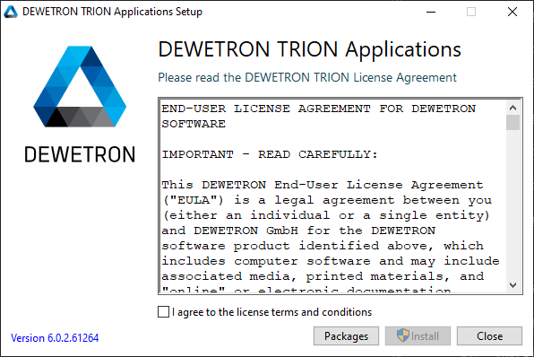
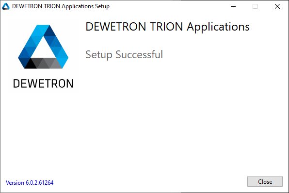
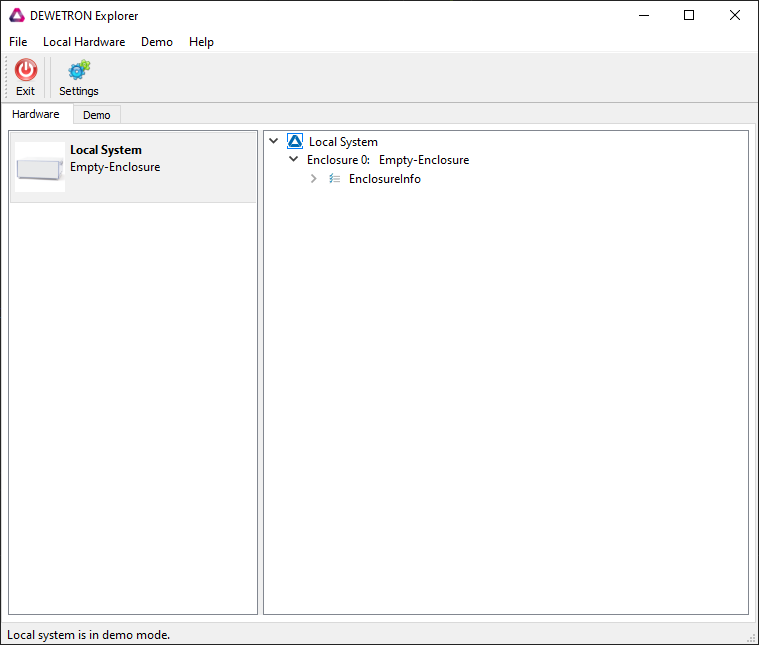
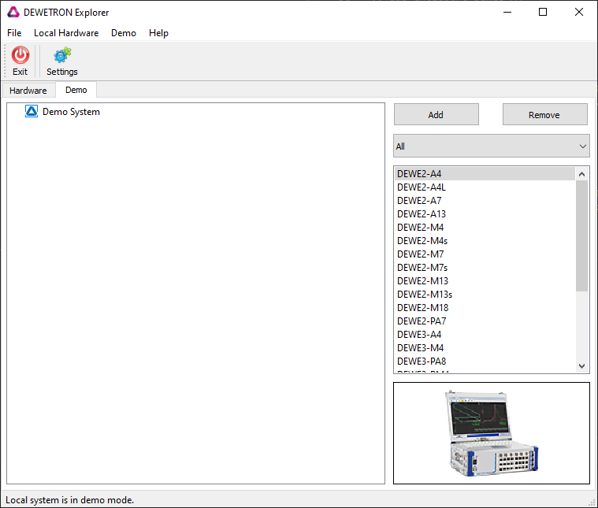
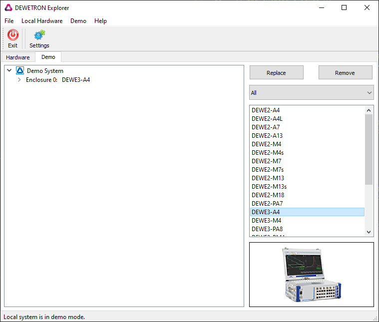
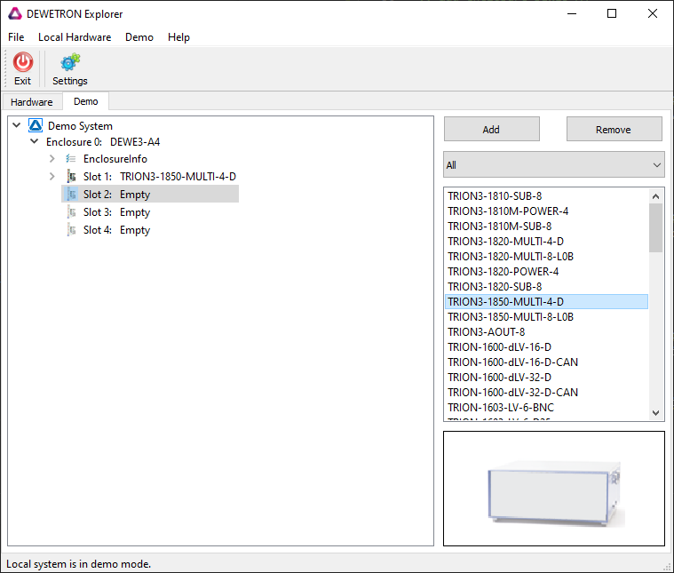
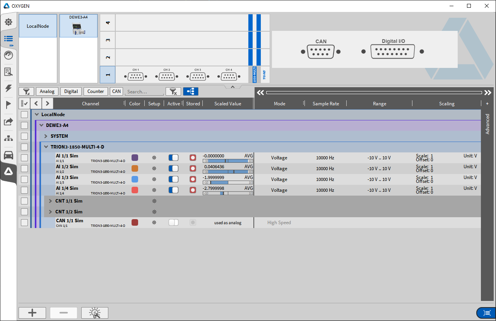

Quickstart
==========

.. why this chapter

.. what is needed?
..   visual studio
..   cmake...
.. Examples in C, C++, C#, Python
..   Focus on C or C++?

Lets dive in fast! This quickstart guide will get you using the TRION-SDK
in just a few steps:

1. TRION Application package installation
2. Setting a simulated measurement device
3. Use DEWETRON OXYGEN to learn about the device
4. Install TRION-SDK and run the quickstart example
5. Have a look at the example source

Before running the SDK, please install the supported tool-chain (something like Visual Studio):

* Visual Studio 2019 or better (for Windows)
* cmake

The TRION API exports a C interface. TRION SDK contains examples for differente programming
languages though main focus will be on C and C++. The presented information will be 
valid for other languages too.

Install TRION API
-----------------

.. download
.. install
.. please ignore TRION-SDK from installer

The first step is the installation of the DEWETRON TRION Application package.

It is available on DEWETRON Customer Support portal. It is found under "TRION Module Driver and SDK".

https://ccc.dewetron.com/pl/dewe3-series

After download please run the installer. When using its default settings it will install

* TRION API for 32bit and 64bit
* DEWETRON TRION Driver
* DEWETRON Explorer
* DEWETRON DEWE2 Driver

.. note:: -  You can omit installation of DEWE2 driver. It is only needed for DEWE2 enclosures and may trigger an unnecessary reboot after installation.

    
    Starting the TRION installer

.. figure:: _img/trion_api_install_2.png
    :alt: TRION installation progress
    :width: 5in
    
    TRION installation progress

    
    TRION installation complete

Start DEWETRON Explorer
-----------------------

.. show GUI
.. show simulation tab
.. add enclosure DEWE3-A4
.. add board TRION3-18XX-MULTI

.. quit

If you are lucky and have DEWETRON TRION hardware available you are ready to go.
You can start OXYGEN or the quickstart example to test your measurment hardware.

All other have to setup a demo system first.
DEWETRON Explorer is the tool for this task. 

The app has two different tabs. The Hardware tab displays detected measurement
devices. This can be local TRION boards or TRIONet devices found in the network.

The demo tab provides functionality to configure a simulated DEWETRON enclosure and
fill its virtual slots with TRION boards.

The next steps guide through the procedure:

1. Switch to demo tab
2. Select a DEWE3-A4 enclosure 
3. Double click on TRION3-1850-MULTI-4-D board to put it into the first free slot
4. Press Save when closing the application.

.. warning:: -  You have to close DEWETRON Explorer to have access to the devices with other applications. TRION API and device access is mutual exclusive!

    
    DEWETRON Explorer hardware window

    
    DEWETRON Explorer demo window

    
    Select DEWE3-A4 enclosure simulation

    
    Select TRION3-1850-MULTI-4-D board

Then quit DEWETRON Explorer and press "Save".
The "demo" system is now available for all applications.

You can use this application to configure a simulation of all possible TRION based
systems.

Please note that TRION3 boards can only be put into DEWE3 enclosures. The simulation
follows the rule that only PXIe boards may be put into compatible slots.
DEWE2 enclosures support PXI only.

The easiest way to verify your demo system is to install and run OXYGEN:

https://www.dewetron.com/products/oxygen-measurement-software/

    
    OXYGEN channel list

Why is there an additional CAN and digital I/O connector shown?

New DEWE3-A4 enclosures feature an internal chassis controller. It provides
timing functionality, CAN and basic digital IO.

Get TRION-SDK
-------------

.. download or clone https://github.com/DEWETRON/TRION-SDK
.. enter TRION-SDK/trion
.. run cmake
.. run studio
.. build QuickStart (aka OneAnalogChannel extreme simple)
.. run QuickStart
.. fun with seeing sample data

https://github.com/DEWETRON/TRION-SDK

Achievements
------------

.. Now you are able to
..   configure simulation
..   build and run an example!

Next Steps
----------

.. What happens in quickstart.cpp?
.. Look at other channel types: Counter, DI, CAN ...
.. Different measurement modes: Bridge, ...
.. Multiple Channels
..   Scan Descriptor (C++)
..   ..

