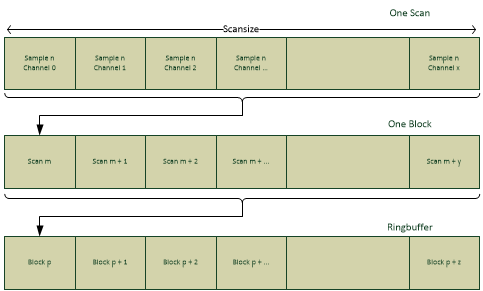

Data Acquisition
================

Buffer
------

    Acquisition ringbuffer

Scan and Scan Size
~~~~~~~~~~~~~~~~~~

One scan is the portion of data that consists of exactly one sample for
each sampled channel on a board.

So if there are 2 analogue channels and 1 counter channel active, the
scan would logically hold three values. (AI0, AI1, CNT0).

The scan-size therefore directly derives from this information. It
describes the memory-consumption of one scan in Bytes. In above example,
when using the AI-channels in 24Bit mode (consuming 32Bit per Sample)
the resulting scan size would be:

ScanSize := sizeof(AI0) + sizeof(AI1) + sizeof(CNT0)

Scansize := 32Bit + 32Bit + 32Bit

Scansize := 4 Byte + 4 Byte + 4 Byte

Scansize := 12 Byte

So one scan would have the size of 12 Byte.

The scan size cannot be directly controlled by the application as it
directly depends on the number and type of activated channels.

Usually the application does not have to know very detailed about one
scan and its layout inherently, as there are ways to get this
information from the API in an abstracted way at runtime.

Block and Block Size
~~~~~~~~~~~~~~~~~~~~

One block is a collection of *n* scans.

It is only meant as a logical unit and does not directly influence the
driver in any way. Usually it is set up in accordance with the
polling-interval of the application.

The block-size can be set to any arbitrary value > 0. A standard use
case would set it to SampleRate \* pollingIntervall. For Example:

BlockSize := SampleRate \* pollingIntervall

BlockSize := 2000 SPS \* 0.1 sec

BlockSize := 200

This has to be set by the application.

Block Count
~~~~~~~~~~~

This defines how many blocks the buffer shall be able to hold. This
allows the application to control how big the backlog of data shall be
and thus how much time the application may spend with tasks not related
to the acquisition – so that peaks in computation times won’t lead to
lost acquisition data.

It can be set to any value > 0, and is only limited by the total
available memory.

For example:

BlockCount := 50

This has to be setup by the application.

Total Buffer Size
~~~~~~~~~~~~~~~~~

The total buffer size is calculated based on the above described
information.

Buffersize := ScanSize \* BlockSize \* BlockCount

In our example:

BufferSize := 12 Bytes \* 200 \* 50

BufferSize := 12 Bytes \* 10000

Buffersize := 12000 Bytes

Synchronous Data Channels
-------------------------

Each sampling period produces one sample for each channel and consumes
“Scan Size” amount of data in the buffer. There are currently three
kinds of synchronous data in the buffer: analog channel samples, counter
channel samples and digital channel samples.

The driver itself maintains a separate read- and write-pointer into this
buffer. So the hardware can add new samples independent of the
applications data-processing.

The driver will notify the application with an error-code if a
buffer-overrun occurs. That is, if the application processes data too
slow, so that the new samples have already overwritten unprocessed old
ones.

The application then can freely decide how to handle this error case.

Buffer Setup and Buffer Ownership
~~~~~~~~~~~~~~~~~~~~~~~~~~~~~~~~~

The buffer itself is completely maintained inside the API – so the
applications do not have to bother with allocation and de-allocation
issues, which usually come with having a buffer.

However – to allow the application a fine granulated control over the
buffer, it is able and obligated to indicate to the API the desired size
of the buffer in terms of logical units, by using the integer-based
functions. The application decides, how many scans one block shall hold,
and how many blocks shall be allocated. The actual size in bytes is then
calculated by the API and the buffer is allocated.

Buffer Readout from Application Point of View
~~~~~~~~~~~~~~~~~~~~~~~~~~~~~~~~~~~~~~~~~~~~~

The ring-buffer is exposed to the application by providing the related
pointer information.

The API will provide:

-  Start-pointer of the ring buffer
-  End-Pointer of the ring buffer
-  Pointer to the first unprocessed scan

Together with the information how many unprocessed samples are available
the application iterates directly over the ring buffer.

This approach allows a minimal internal overhead on data-access.

Scan Descriptor
---------------

As mentioned before a scan is the portion of data
containing exactly one sample per used channel. Without knowledge about
its internal layout, this would just be a binary stream with arbitrary
length.

But the application does not need to know implicitly about the layout of
the data. This would be undesirable, as the layout may change with
coming driver versions or coming hardware. For example, when a new type
of synchronous data will be added, inherent hardcoded knowledge within
the application would immediately break the data-readout mechanism of
the application.

So after setting up the acquisition environment, the API can be queried
about the layout.

The detailed layout-information will be returned as an XML-string.

.. code-block:: XML
    :caption: BoardProperties - ScanDescriptor Example

    <ScanDescriptor>
        <BoardId0>
            <ScanDescription version="2" scan_size="96" byte_order="little_endian" unit="bit">
                <Channel type="Analog" index="3" name="AI3">
                    <Sample offset="32" size="24" />
                </Channel>
            </ScanDescriptor>
        </BoardId0>
    </ScanDescriptor>

Scan Descriptor Structure
~~~~~~~~~~~~~~~~~~~~~~~~~

The following API string command returns the scan information for a
specific Board:

.. code:: c

    DeWeGetParamStruct_str( "BoardId0", "ScanDescriptor_V2", Buf, sizeof(Buf));

The returned XML document correlates with the following hierarchy:

#. <ScanDescriptor> : XML Element. Max. Occurrences: 1.
#. <BoardID0> : XML Element. Max. Occurrences: 1.
#. <ScanDescription> : XML Element. Max. Occurrences: 1.
#. <Channel> : XML Element. Max. Occurrences: Unbounded.
#. <Sample> : XML Element. Max. Occurrences: Unbounded.

Please be aware that the scan descriptor annotates only the enabled
channels for a specific Board. In case no channel is enabled, the API
returns an empty scan descriptor with “scan_size” set to the value 0.

The API considers disabled channels and therefore the returned
“scan_size” and “offsets” are being returned accordingly.

The following list depicts all possible XML Elements and their XML
attributes and values of the returned scan descriptor XML document:

.. tabularcolumns:: |p{2.5cm}|p{2.5cm}|p{9cm}|

.. table:: TEDS XML description
   :widths: 10 10 80

   +-------------------+--------------------------+------------------------------------------------------+
   | **Element**       | **Attribute**            | **Description**                                      |
   +===================+==========================+======================================================+
   | ScanDescriptor    |                          | ScanDescriptor root element                          |
   +-------------------+--------------------------+------------------------------------------------------+
   | BoardIdXX         |                          | Selected board elememt “BoardID0”                    |
   +-------------------+--------------------------+------------------------------------------------------+
   | ScanDescription   |                          | Describes the scan for the requested board           |
   +-------------------+--------------------------+------------------------------------------------------+
   |                   | version                  | Scan descriptor’s document version (Should be 2)     |
   +-------------------+--------------------------+------------------------------------------------------+
   |                   | scan_size                | The size of the scan expressed in unit               |
   +-------------------+--------------------------+------------------------------------------------------+
   |                   | byte_order               | The byte order of the scan ("little_endian")         |
   +-------------------+--------------------------+------------------------------------------------------+
   |                   | unit                     | The unit of “scan_size” attribute ("bit")            |
   +-------------------+--------------------------+------------------------------------------------------+
   | Channel           |                          | Channel element                                      |
   +-------------------+--------------------------+------------------------------------------------------+
   |                   | type                     | Value: string "Analog", "Counter", "Discrete"        |
   +-------------------+--------------------------+------------------------------------------------------+
   |                   | index                    | The channel index on the specific board              |
   +-------------------+--------------------------+------------------------------------------------------+
   |                   | name                     | API name of the channel "AI0"                        |
   +-------------------+--------------------------+------------------------------------------------------+
   | Sample            |                          | Detailed sample description                          |
   +-------------------+--------------------------+------------------------------------------------------+
   |                   | offset                   | The offset within the whole scan                     |
   +-------------------+--------------------------+------------------------------------------------------+
   |                   | size                     | the size of the sample                               |
   +-------------------+--------------------------+------------------------------------------------------+
   |                   | subChannel               | Optional attribute for counter sub channels          |
   +-------------------+--------------------------+------------------------------------------------------+

.. warning::
    When requesting a scan descriptor with command “ScanDescriptor” (Version
    1), some newer board may not be able to return a valid scan descriptor
    for analog 24bit channels. Therefore, always use “ScanDescriptor_V2”.

Scan Descriptor Example Source Code
~~~~~~~~~~~~~~~~~~~~~~~~~~~~~~~~~~~

.. literalinclude:: ../../trion/CXX/quickstart/quickstart_acq_scan_desc.cpp
    :caption: Scan Descriptor example
    :language: c++
    :linenos:
    :lines: 9-

Sample Rate
-----------

Synchronous Acquisition
-----------------------

Asynchronous Acquisition
------------------------

.. CAN
.. CANFD
.. UART

Data Output
-----------

.. Analog
.. Digital
.. CAN(FD)-OUT
.. UART-OUT
