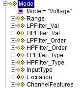

XML Reference
=============

TRION-SDK exposes information about the measurement devices by
exporting multiple different xml documents. These hold information
about the selected measurement device, acquisition parameters,
calibration information and many more.

This section explains howto access and manipulate those documents.

Relevant API interface
----------------------

XML documents can be accessed by the DeWeSetParamStruct_str class
functions. XPath operations on these documents are possible by
using the DeWeSetParamXML_str class functions.

.. code:: c

    int DeWeSetParamStruct_str)(const char *target,
        const char *command,
        const char *val);
    int DeWeGetParamStruct_str(const char *target,
        const char *command,
        char *val,
        uint32 val_size);
    int DeWeGetParamStructEx_str(const char *target,
        const char *command,
        char *val,
        uint32 val_size);
    int DeWeGetParamStruct_strLEN(const char *target,
        const char *command,
        uint32 *val_size);

    int DeWeSetParamXML_str(const char *target,
        const char *command,
        const char *val);
    int DeWeGetParamXMLStruct_str(const char *target,
        const char *command,
        char *val,
        uint32 val_size);
    int DeWeGetParamXMLStruct_strLEN(const char *target,
        const char *command,
        uint32 *val_size);

Accessible Documents
--------------------

1. BoardProperties.xml

..  * AcquisitionProperties
..  * ChannelProperties

BoardProperties XML-File
------------------------

The Boardproperties XML-file serves several purposes:

-  It holds information specific to a single board, like

   -  Board-type and Board-name
   -  The serial number
   -  Information in which enclosure and at which slot within the
      enclosure this board can be found in the physical system

-  It is the implicit documentation of the capabilities that one
   specific board offers
-  It is the implicit documentation of all settable properties of a
   single board together with the definition set for each property.

So instead of having the risk of a potentially outdated
paper-documentation about the logical capabilities of a single board,
this XML-File can and should be used as a look-up reference while
developing an application.

This file is generated at runtime and will therefore always reflect the
actual capabilities of the current API-version in conjunction with the
current capabilities of one specific board. So for example if either the
API and/or the firmware of a specific board are enhanced with new
functionality that is externally accessible, this fact will be
immediately visible in the generated file.

This file is internally used by the API for parameter-checking. Using
this file as base for the application guarantees using valid settings
that will be accepted by the API.

Not all information within this file is strictly necessary for operating
the board. Some of the information only serves documentation or
maintenance purposes.

Relevant Sections of the File
~~~~~~~~~~~~~~~~~~~~~~~~~~~~~

The top-level nodes of the XMLfile are:

    BoardProperties Root Node

Version
^^^^^^^

This node holds detailed information about the API and the input-source
used for generating the properties file. Its main use is for
documentation purposes.

BoardInfo
^^^^^^^^^

This node holds detailed information about the board itself like

-  Serial number
-  Firmware version information
-  Administrative information about the calibration

SystemInfo
^^^^^^^^^^

This node holds detailed information about the enclosure the board is
residing in. For example the PXI-slot-number could be extracted from
here to be shown in the application User Interface.

Variable
^^^^^^^^

This node only serves internal purposes and is not meant to be used
by the application directly.

BoardFeatures
^^^^^^^^^^^^^

This section roughly describes the acquisition capabilities of the board
at hand. This example shows a TRION-2402-dACC-6-BNC (analog sampling
board with six analog channels)

.. code-block:: XML
    :caption: BoardProperties - BoardFeatures Node

    <BoardFeatures>
        <AI>
            <Channels>6</Channels>
            <Resolution Count = "2" Default = "0">
                <ID0>24</ID0>
                <ID1>16</ID1>
            </Resolution>
        </AI>
        <ARef>
            <Channels>1</Channels>
        </ARef>
        <CNT>
            <Channels>2</Channels>
            <Resolution>32</Resolution>
            <TimeBase Unit = "MHz">80</TimeBase>
        </CNT>
        <BoardCNT>
            <Channels>1</Channels>
            <Resolution>32</Resolution>
            <TimeBase Unit = "MHz">80</TimeBase>
        </BoardCNT>
        <ChnNoStart>
            <AI/>
            <CNT/>
            <BoardCNT/>
            <DI/>
            <CAN/>
        </ChnNoStart>
    </BoardFeatures>

From this information the application can deduce:

-  The board has six analog input channels
-  The analog input channels can be used with 16 and 24 Bit resolution
-  The default resolution is 24 Bit
-  2 counter channels are available with a 80MHz resolution
-  1 internal counter channel is available - a so called BoardCounter
-  No digital or CAN channels are available

AcquisitionProperties
---------------------

This node holds very detailed information about the various settings
necessary for the synchronization capabilities of the board and general
settings affecting the acquisition itself (e.g. the sample-rate).

This node is very elaborate and needs only to be considered in detail
for more advanced setup. Discussing these nodes in detail is beyond the
scope of this document. So its contents are not fully shown here.

One more general sub-node within this node is AcqProp

AcqProp
~~~~~~~
This node holds generic setup information about the acquisition
parameters for this board.

.. figure:: _img/image7.png
    :align: center

    BoardProperties - AcqProp Node

Illustration 7 - BoardProperties - AcqProp Node

The most interesting sub-elements within here probably are:

-  SampleRate
-  OperationMode
-  ResolutionAI

SampleRate
^^^^^^^^^^

.. figure:: _img/image8.png
    :align: center

    BoardProperties - SampleRate Node

This allows the application to know the upper and lower limits of the
available sample-rates. In this case the range goes from 100
Samples/second up to 200 kSamples/second, 204800 Hz to be exact.

OperationMode
^^^^^^^^^^^^^

.. code-block:: XML
    :caption: BoardProperties - OperationMode Node

    <OperationMode Count = "2" Default = "0">
        <ID0>Slave</ID0>
        <ID1>Master</ID1>
    </OperationMode>

This property allows selecting the predefined roles of the board within
a multi-board system. Together with the information about external
clocking and external triggering this will automatically set up the
routing for the internal trigger- and clock-lines to a predefined state
that is suited to make the board fulfill its desired role.

ResolutionAI
^^^^^^^^^^^^

.. code-block:: XML
    :caption: BoardProperties - ResolutionAI Node

    <ResolutionAI Count = "2" Default = "0">
        <ID0>24</ID0>
        <ID1>16</ID1>
    </ResolutionAI>

This property allows setting the analog channels to a desired
ADC-resolution.

ChannelProperties
-----------------

This node gives exhaustive information about all available acquisition
channels and all their settable properties.

.. figure:: _img/image9.png
    :align: center

    BoardProperties - ChannelProperties Node

In this case, the XML-File shows that:

-  There are six analog channels, labeled AI0 to AI5
-  Two counter channels, labeled CNT0 and CNT 1
-  One internal counter (the Board-Counter), labeled BoardCNT0

The basic layout for all the channel-types is always the same and allows
for easy initial navigation within the node.

The analog channel 0 is used as example to explain this in more depth.

.. figure:: _img/image10.png
    :align: center

    BoardProperties - AI0 Channel Node

The first layer always holds:

-  a list of supported operation modes
-  the Used-flag itself as it is independent of the chosen mode

In this example the list of modes is:

-  <Mode Mode = "Calibration">
-  <Mode Mode = "Voltage">
-  <Mode Mode = "Resistance">
-  <Mode Mode = "IEPE">

Element AI0
~~~~~~~~~~~

Looking at AI0 Channel Node, the
default indicates that the mode “Voltage” is set as default.

Each of the modes lists its own associated properties.

The list of applicable properties may vary between the modes. Properties
which are only mentioned in some modes but not in others simply indicate
that they would have no actual meaning in the modes where they are not
listed.

Here within the analog channels this is not the case. An example would
be counter-channels that have a mode called “Simple Event Counting” -
that only takes one input signal - and therefore have only one source
mentioned in this mode but also support a “gated event counting” - that
will take two distinct input-signals - and therefore has two separate
sources settable.

Taking the Voltage mode as an example:

Voltage/Range
^^^^^^^^^^^^^

    BoardProperties - Voltage Mode

This is the exhaustive list of supported properties for an analog
channel in voltage mode.

The most obvious property here is Range:

.. code-block:: XML
    :caption: BoardProperties - Range Node

    <Range
        Unit = "V"
        Count = "7"
        Default = "0"
        Programmable = "True"
        MinInputOffset = "-200"
        MaxInputOffset = "200"
        MinOutputOffset = "-150"
        MaxOutputOffset = "150"
        MinTotalOffset = "-300"
        MaxTotalOffset = "300"
        AmplRangeMin = "0.01"
        AmplRangeMinUnit = "V"
        AmplRangeMax = "100"
        AmplRangeMaxUnit = "V"
        ProgMax = "100"
        ProgMin = "-100">
        <ID0 MinInputOffset = "-100" MaxInputOffset = "100">100</ID0>
        <ID1>30</ID1>
        <ID2>10</ID2>
        <ID3>3</ID3>
        <ID4>1</ID4>
        <ID5>0.3</ID5>
        <ID6>0.1</ID6>
        <ID7>0.03</ID7>
    </Range>

From this information the application can deduce:

-  The analog input supports ranges from 0.03V to 200V
-  The default input range is 200V
-  It is freely programmable. So any value between min and max can be
   set and the hardware is not limited to the values presented in the
   list
-  Various information about offsets. Explaining these in detail is
   beyond the scope of this overview document.

Using the BoardProperties XML-File
----------------------------------

With the overview provided in mind one obvious use case
for this document is to allow the application to perform some
preliminary evaluation of settings before trying to apply them to the
API.

One other use case would be that it easily allows the application to
decide about setup-information shown in the user-interface if needed. It
would be easy to just offer such options in the UI that are actually
supported by the board for the given mode.

One less obvious information the document provides is information needed
for the string based functions – namely the target string and the
item-identifier.

Deriving Target Strings and Item IDs from the Document
~~~~~~~~~~~~~~~~~~~~~~~~~~~~~~~~~~~~~~~~~~~~~~~~~~~~~~

As shown all logical properties are addressed by strings.

As a rule of thumb one can assume that the target string matches the
path within the XML-File starting from the root but omitting the first
node-level.

The last element identifies the Items. Anything that remains in before
is part of the target-string.

This is entirely true for the acquisition properties and slightly
different for the channel properties. The detailed rational for this
approach is provided within this chapter along with a couple of
examples.

Acquisition Properties
^^^^^^^^^^^^^^^^^^^^^^

While the examples provided here will look awfully complicated on first
sight, the procedure itself is generic enough to become natural to the
application developer very quickly.

Example: How to setup/retrieve the SampleRate with the string based functions
'''''''''''''''''''''''''''''''''''''''''''''''''''''''''''''''''''''''''''''

Path within the XML-File: AcquisitionProperties/AcqProp/SampleRate

Derived target and item-string for the string based functions:

-  Applying the rule of omitting the first node-level: AcqProp/SampleRate
-  Last part is the item: “SampleRate”
-  Remainder for the target string: AcqProp
-  As the target-string always needs the BoardID as part of it the
   complete Target string is: “BoardID0/AcqProp”

So the final function call looks like:

.. code:: c

    DeWeSetParamStruct_str( "BoardID0/AcqProp", "SampleRate", "20000" );

Example: How to setup the ResolutionAI
''''''''''''''''''''''''''''''''''''''

Path within XML-File: AcquisitionProperties/AcqProp/ResolutionAI

Derived target- and item-string:

- Target: “BoardID0/AcqProp”
- Item: “ResolutionAI”

Final function call:

.. code:: c

    DeeSetParamStruct_str( "BoardID0/AcqProp", "ResolutionAI", "16" );

Channel Properties
^^^^^^^^^^^^^^^^^^

As discussed in the first level on a single channel
within the XML-File is a list of various modes grouping the properties
meaningful for the given mode.

This has two consequences when deriving target and item information:

#. Mode itself is a valid Item
#. When addressing any property the mode-node is omitted within the
   target

Example: How to set the mode of an analog channel to Resistance
'''''''''''''''''''''''''''''''''''''''''''''''''''''''''''''''

Path within XML-File: ChannelProperties/AI0/Mode
Derived target- and item-string:

- Target: “BoardID0/AI0”
- Item: “Mode”

Final function call:

.. code:: c

    DeWeSetParamStruct_str( "BoardID0/AI0", "Mode", "Resistance" );

Example: How to set the Range of an analog channel in Resistance-mode
'''''''''''''''''''''''''''''''''''''''''''''''''''''''''''''''''''''

Path within XML-File: ChannelProperties/AI0/Mode/Range

Derived target- and item-string:

- Target: “BoardID0/AI0”
- Item: “Range”

Final function call:

.. code:: c

    DeWeSetParamStruct_str( "BoardID0/AI0", "Range", "3000" );

Complex property notations
~~~~~~~~~~~~~~~~~~~~~~~~~~

Some properties have either complex relations to other properties or
have a more complex mathematical ruleset needed to determine
their constraints.
Some properties are read-only information, and are not meant to
be set by an application.

Those things are indicated with xml-attributes.

List of xml-attributes indicating a complex property
^^^^^^^^^^^^^^^^^^^^^^^^^^^^^^^^^^^^^^^^^^^^^^^^^^^^

.. tabularcolumns:: |p{2cm}|p{2cm}|p{8cm}

.. table:: Special xml-attributes
   :widths: 10 10 80

   +----------------------+----------+-------------------------------------+
   | Atributename         | Value    | Meaning                             |
   +======================+==========+=====================================+
   | Config               | False    | Indicates a read-only-property with |
   |                      |          | a static value, or no relevant      |
   |                      |          | value at all, only providing        |
   |                      |          | taxative information                |
   |                      |          |                                     |
   |                      |          | Example: Node "ChannelFeatures"     |
   +----------------------+----------+-------------------------------------+
   | Config               | Derived  | Indicates a read-only-property with |
   |                      |          | a value that is derived from other  |
   |                      |          | properties.                         |
   |                      |          |                                     |
   |                      |          | Example: Node "ShuntResistance" in  |
   |                      |          | bridge-mode on a TRION-18XX-MULTI   |
   +----------------------+----------+-------------------------------------+
   | Calculated           |          | Indicates a property where some or  |
   |                      |          | all constraints are dynamic and     |
   |                      |          | can be calculated with a given      |
   |                      |          | mathematical expression             |
   |                      |          |                                     |
   |                      |          | see :ref:`Calculated values         |
   |                      |          | notations                           |
   |                      |          | <calculated_values_notation>`       |
   |                      |          |                                     |
   |                      |          |                                     |
   |                      |          | Example: Node "ShuntTarget" in      |
   |                      |          | bridge-mode on a TRION-18XX-MULTI   |
   +----------------------+----------+-------------------------------------+
   | Subkey               | *various*| Indicates a property that depends   |
   |                      |          | in its validity on the setting      |
   |                      |          | of a different property.            |
   |                      |          |                                     |
   |                      |          | see ReferenceNode                   |
   |                      |          |                                     |
   |                      |          | see :ref:`Complex inter-property    |
   |                      |          | dependency notations                |
   |                      |          | <complex_inter_property_dependency>`|
   |                      |          |                                     |
   |                      |          | Example: Node "BridgeRes" in        |
   |                      |          | bridge-mode on a TRION-18XX-MULTI   |
   +----------------------+----------+-------------------------------------+
   | ReferenceNode        | *various*| Holds a semicolon seperated list of |
   |                      |          | property-names that are affect      |
   |                      |          | in their constraint-set by changes  |
   |                      |          | of this property.                   |
   |                      |          |                                     |
   |                      |          | see Subkey                          |
   |                      |          |                                     |
   |                      |          | see :ref:`Complex inter-property    |
   |                      |          | dependency notations                |
   |                      |          | <complex_inter_property_dependency>`|
   |                      |          |                                     |
   |                      |          | Example: Node "InputType" in        |
   |                      |          | bridge-mode on a TRION-18XX-MULTI   |
   +----------------------+----------+-------------------------------------+

.. _complex_inter_property_dependency:

Complex inter-property dependency notations
~~~~~~~~~~~~~~~~~~~~~~~~~~~~~~~~~~~~~~~~~~~

More complex measurement modes may have complex dependencies
between single properties.
Selecting one specific property-value can shrink or widen the
selection on other properties.

If a property influences the constraints of another property
this is indicated with the xml-attribute "ReferenceNode" on
property-node-level.

.. warning::
    One property may influnece more than one other property.
    The value of the xml-attribute "ReferenceNode" holds a semicolon
    seperated list of affected attributes.

    For example "ShuntType;Range"

Implicit Property selector mechanism
^^^^^^^^^^^^^^^^^^^^^^^^^^^^^^^^^^^^

In Bridgemode exists an implicite dependency between "Excitation" and
"Range".
This dependency is not annotated in the xml-structure.
When using voltage-excitation the "Range"-node to use is the one with
"Unit" = "mV/V".
When using current-excitation the "Range"-node to use is the one with
"Unit" = "mV/mA".

Explicit Property selector mechanism
^^^^^^^^^^^^^^^^^^^^^^^^^^^^^^^^^^^^

A property may influence a differnt property in a way, that the most
clear way of communicating this is by using a different definitionset
for the influenced property.

The following exmple will help to make this more clear.

.. code-block:: XML
    :caption: Property selector mechanism exmple, Bridge Resistance

    <InputType Count = "9" Default = "0" ReferenceNode = "BridgeRes">
        <ID0 Type = "External">BRFULL</ID0>
        <ID1 Type = "External">BRFULL5W</ID1>
        <ID2 Type = "External">BRHALF</ID2>
        <ID3 Type = "External">BRHALF4W</ID3>
        <ID4 Type = "Internal">BRQUARTER3W</ID4>
        <ID5 Type = "Internal">BRQUARTER4W</ID5>
        <ID6 Type = "Internal">CompletionVoltage</ID6>
        <ID7 Type = "Internal">LineVoltageDrop</ID7>
        <ID8 Type = "NA">Short</ID8>
    </InputType>
    <BridgeRes
        Unit = "Ohm"
        Count = "3"
        Default = "2"
        Subkey = "Type"
        Type = "Internal">
        <ID1>1000</ID1>
        <ID2>350</ID2>
        <ID7>120</ID7>
    </BridgeRes>
    <BridgeRes
        ProgMin = "50"
        ProgMax = "10000"
        Unit = "Ohm"
        Count = "2"
        Default = "0"
        Subkey = "Type"
        Type = "External">
        <ID0>350</ID0>
        <ID1>120</ID1>
    </BridgeRes>
    <BridgeRes
        Count = "0"
        Subkey = "Type"
        Type = "NA"/>

In this exmple the property "InputType" determines which definition set
of "BridgeRes" is valid.

InputType has the xml-attribute "ReferenceNode" with a value of
"BridgeRes".
This indicates, that "BridgeRes" depends on "InputType".

Each ID node (ID0 to ID8) of "InputType" has a xml-attribute "Type".
The name of this attribute can differ from "Type". The referenced
node(s) establish a relation to this attribute.

On the same xml-level as "InputType" there are 3 nodes "BridgeRes".
Each of these nodes has a xml-attribute "Subkey".
The value of "Subkey" determines which xml-attribute-name determines
the selection of this node.
In this example "Subkey" has the value of "Type".
This indicates, that the "Type"-Attributes on ID-node-level in
"InputType" needs to be looked at.

The "Subkey" xml-attribute is followed with a "Type" attribute.
The actual name of this attribute is always the same, as the value
of the "Subkey" attribute.
The value of the "Type" xml-attribute now is the value of the "Type"
xml-attributes from "InputType" to look for a match.

Examples:

If "InputType" is set to a value of "BRQUARTER3W", "BRQUARTER4W",
"CompletionVoltage"or "LineVoltageDrop" the Type-attribute in "InputType"
would have the assigned value of "Internal".
So the 1st BridgeRes Node has to be applied to determine the definition-set
for BridgeRes. (As the 1st node has "SubKey"="Type" and "Type="Internal").

.. code-block:: XML
    :caption: InputType Internal

    <InputType Count = "9" Default = "0" ReferenceNode = "BridgeRes">
        <ID4 Type = "Internal">BRQUARTER3W</ID4>
        <ID5 Type = "Internal">BRQUARTER4W</ID5>
        <ID6 Type = "Internal">CompletionVoltage</ID6>
        <ID7 Type = "Internal">LineVoltageDrop</ID7>
    </InputType>

.. code-block:: XML
    :caption: BridgeRes Internal

    <BridgeRes
        Unit = "Ohm"
        Count = "3"
        Default = "2"
        Subkey = "Type"
        Type = "Internal">
        <ID1>1000</ID1>
        <ID2>350</ID2>
        <ID7>120</ID7>
    </BridgeRes>

If "InputType" is set to a value of "BRFULL", "BRFULL5W", "BRHALF"
or "BRHAL4W" the Type-attribute in "InputType" would have the assigned
value of "External"
So the 2nd BridgeRes Node has to be applied to determine the definition-
set for BridgeRes. (As the 2nd node has "SubKey"="Type" and "Type="External").

.. code-block:: XML
    :caption: InputType External

    <InputType Count = "9" Default = "0" ReferenceNode = "BridgeRes">
        <ID0 Type = "External">BRFULL</ID0>
        <ID1 Type = "External">BRFULL5W</ID1>
        <ID2 Type = "External">BRHALF</ID2>
        <ID3 Type = "External">BRHALF4W</ID3>
    </InputType>

.. code-block:: XML
    :caption: BridgeRes External

    <BridgeRes
        ProgMin = "50"
        ProgMax = "10000"
        Unit = "Ohm"
        Count = "2"
        Default = "0"
        Subkey = "Type"
        Type = "External">
        <ID0>350</ID0>
        <ID1>120</ID1>
    </BridgeRes>

If "InputType" is set to a value of "Short" the Type-attribute in "InputType"
would have the assigned value of "NA"
So the 3rd BridgeRes Node has to be applied to determine the definition-set
for BridgeRes. (As the 3rd node has "SubKey"="Type" and "Type="NA").
In this case this results in an empty definition-set indicating that
this property is not used in that combination.

.. code-block:: XML
    :caption: InputType NA

    <InputType Count = "9" Default = "0" ReferenceNode = "BridgeRes">
        <ID8 Type = "NA">Short</ID8>
    </InputType>

.. code-block:: XML
    :caption: BridgeRes NA

    <BridgeRes
        Count = "0"
        Subkey = "Type"
        Type = "NA"/>

Everytime the application sets a property with depending nodes, API
evaluates this information an adjusts it's internal validity checks according.
If the previously set value of the depending property would still be valid
after reevaluation the value will be left unchanged by TRION-API.
If the previously set value of the depending property would be invalid
the value will be set to the given Default of the newly selected definition-
set.

Example 1:
"InputType" = "BRFULL"
"BridgeRes" = "1000 Ohm" (legal, as "BridgeRes"
with "Type"="External is freely programmable")

change "InputType" to "BRQUARTER3W"
This changes the "BridgeRes" to "Type"="Internal".
"1000 Ohm" is in the list of valid options for this table (ID1),
so the value remains
unchanged.

Example 2:
"InputType" = "BRFULL"
"BridgeRes" = "420 Ohm" (legal, as "BridgeRes" with "Type"="External
is freely programmable")

change "InputType" to "BRQUARTER3W"
This changes the "BridgeRes" to "Type"="Internal".
As this node is not programmable, and a value of "420 Ohm" is not within
the list of valid values, API has to reset this to it's default of "350 Ohm".

.. _calculated_values_notation:

Calculated values notations
~~~~~~~~~~~~~~~~~~~~~~~~~~~

Being a static document, the boardproperties document can not directly
transport dynamic values.

To transport such dependencies the xml-node will hold an attribute
named "Calculated".

.. code-block:: XML
    :caption: Calculated values notations - Example

    <ShuntTarget
        Unit = "mV/V"
        Count = "1"
        Default = "0"
        Programmable = "True"
        Calculated = ""
        ProgMin = "10.0 * 1e-6 * 'R_BRIDGE' / (2.0 * 'EXCVoltage') * 1e3"
        ProgMax = "75.0 * 1e-6 * 'R_BRIDGE' / (2.0 * 'EXCVoltage') * 1e3">
            <ID0>2</ID0>
            <Setting VariableName = "R_BRIDGE" Type = "AI0" Path = "" Item = "BridgeRes" Unit = "Ohm"/>
            <Setting VariableName = "EXCVoltage" Type = "AI0" Path = "" Item = "Excitation" Unit = "V"/>
    </ShuntTarget>

This example is from a TRION3-1820-MULTI-4-D in bridge-mode.
The maximum and minimal valid values are mathematically dependent on the
brige-resistance and the voltage-excitation.

    .. math:: ProgMin = \frac{10.0 * 10^6 * R\_BRIDGE[\Omega]}{2 * 10^3 * EXCVoltage[V]}
    .. math:: ProgMax = \frac{75.0 * 10^6 * R\_BRIDGE[\Omega]}{2 * 10^3 * EXCVoltage[V]}

The 'Setting'-nodes indicate how to obtain the values needed in the
calculation.
Those values should be accessed by DeWeGetParamStruct_str-commands.

.. table:: Setting node xml attributes
   :widths: 20 80

   +---------------+--------------------------------------------------+
   | xmlattribute  | explaination                                     |
   +===============+==================================================+
   | VariableName  ||  Name of a variable used by the equation(s)     |
   |               ||  eg "R_BRIDGE"                                  |
   +---------------+--------------------------------------------------+
   | Type          |  These two attributes together form the          |
   | Path          |  targe part for the DeWeGetParamStruct_str       |
   |               |  call:                                           |
   |               |                                                  |
   |               |  "BoardId[X]\\[Type]\\[Path]"                    |
   |               |                                                  |
   |               |  BoardId[X]: the board-id of the current board   |
   |               |                                                  |   
   |               |  if "Path" is empty the final backslash shall    |
   |               |  be ommited                                      |
   +---------------+--------------------------------------------------+
   | Item          |  The command part for the DeWeGetParamStruct_str |
   |               |  call.                                           |
   +---------------+--------------------------------------------------+
   | Unit          | For informational purposes                       |
   +---------------+--------------------------------------------------+

So in this example the two varaibles should be obtained with the
following commands:

.. code:: c

    DeWeGetParamStruct_str("BoardID0\\AI0", "BridgeRes", R_BRIDGE_var, sizeof());
    DeWeGetParamStruct_str("BoardID0\\AI0", "Excitation", EXCVoltage_var, sizeof());

With these two values at hand the values for ProgMin and ProgMax can be
calculated.

BoardConfig XML-File
--------------------

Purpose of the File
~~~~~~~~~~~~~~~~~~~

The detailed layout of the configuration-file is board specific. It can
be derived from the content of the BoardProperties XML-File.

The file has three major sections:

<BoardInfo>

This section holds basic information about the board from which this
configuration was generated from. This includes the BaseModel-Number and
the human readable BoardName (BoardType, eg. TRION-BASE).

<Acquisition>

This is the counterpart to the Node <AcquisitionProperties> in the
BoardProperties-XML-Document.

Each property from the BoardProperties-XML-Document, that is not marked
with the attribute “Config = ‘False’” is also present in the
<Acquisition> Node in the configuration document.

This includes some obvious information like for example the “SampleRate”
as well, as for example detailed routing information for the
PXI-trigger-lines or the Star-Hub.

<Channel>

This is the counterpart to the Node
<ChannelProperties> in the BoardProperties-XML-document.

Each single channel is present within this node, with each of the
settable properties, that is not marked with the attribute “Config =
‘False’” inside the BoardProperties-XML-document.

    Configuration-XML major sections

.. figure:: _img/image13.png
    :align: center

    Configuration XML Section: Acquisition

    Configuration XML Section: Channel

Result XML Document
~~~~~~~~~~~~~~~~~~~

The result xml-document has the same layout, as the configuration
xml-document.

It’s main purpose is to provide a fine granulated feedback about any
set-configuration command. When loading (setting) a configuration, each
property is applies one after the other. Every single setting-command
(this means every set single property) ends up in a defined result
state. Ideally the operation succeeds with ERR_NONE. However - as any
arbitrary configuration can be presented to any board, this isnot
guaranteed at all.

To make diagnostics easier, this result-file offers the possibility to
see the exact result of each single property.

Depending on the API-configuration itself, either all results are
returned, or only results <> ERR_NONE.

The following figure shows an example for a result-file, when trying to
apply a 8-AI-Channel-board configuration to a board, that only supports
6 AI-channels.

All settings are applied ok, except for the non-existing channels AI6
and AI7.

.. code-block:: XML
    :caption: Configuration load result XML example

    <?xml version="1.0"?>
    <Results>
        <Acquisition>
            <AcqProp>
                <StartCondition>Warning -190910, WARNING_STARTCONDITION_NOT_USED (-190910)</StartCondition>
            </AcqProp>
        </Acquisition>
        <Channel>
            <AI6>
                <Mode>Error 120012, ERROR_AI_CHANNEL_NOT_VALID (120012)</Mode>
            </AI6>
            <AI7>
                <Mode>Error 120012, ERROR_AI_CHANNEL_NOT_VALID (120012)</Mode>
            </AI7>
        </Channel>
    </Results>

Scan Descriptor
~~~~~~~~~~~~~~~

TODO

TEDS
~~~~

TODO
